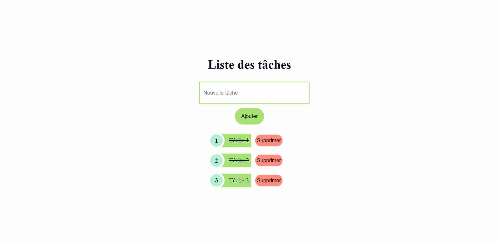

# Initiation ReactJS avec TypeScript et ViteJS
* Prise en main de ReactJS avec TypeScript et ViteJS, création d'une todo-list :
    - Ajout d'une tâche
	- Suppression d'une tâche
	- Marquer une tâche comme terminée

    
Rendu

    

